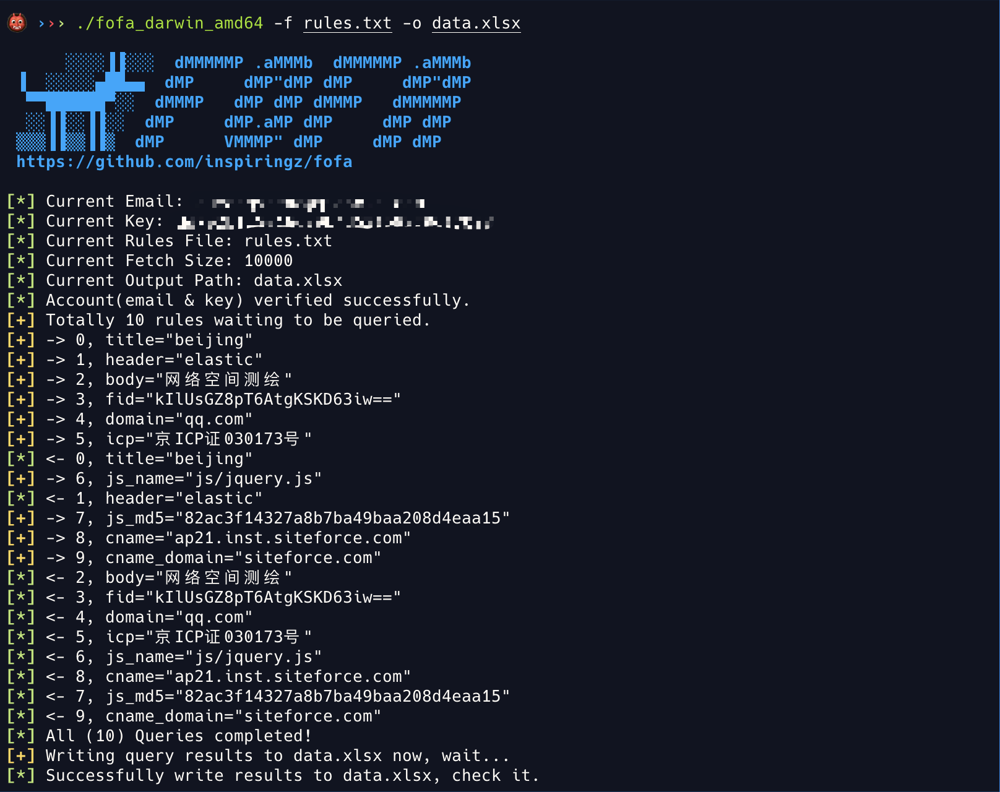
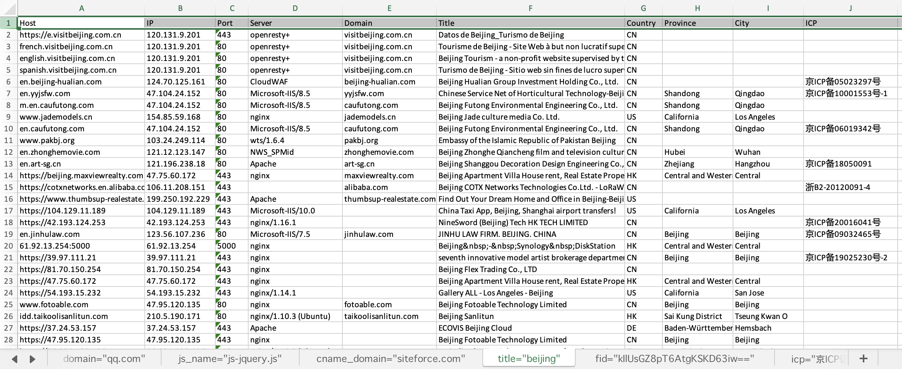
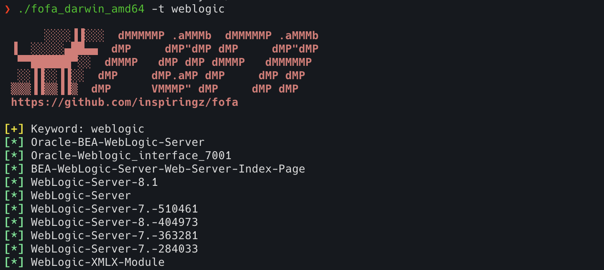
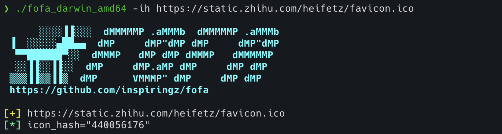
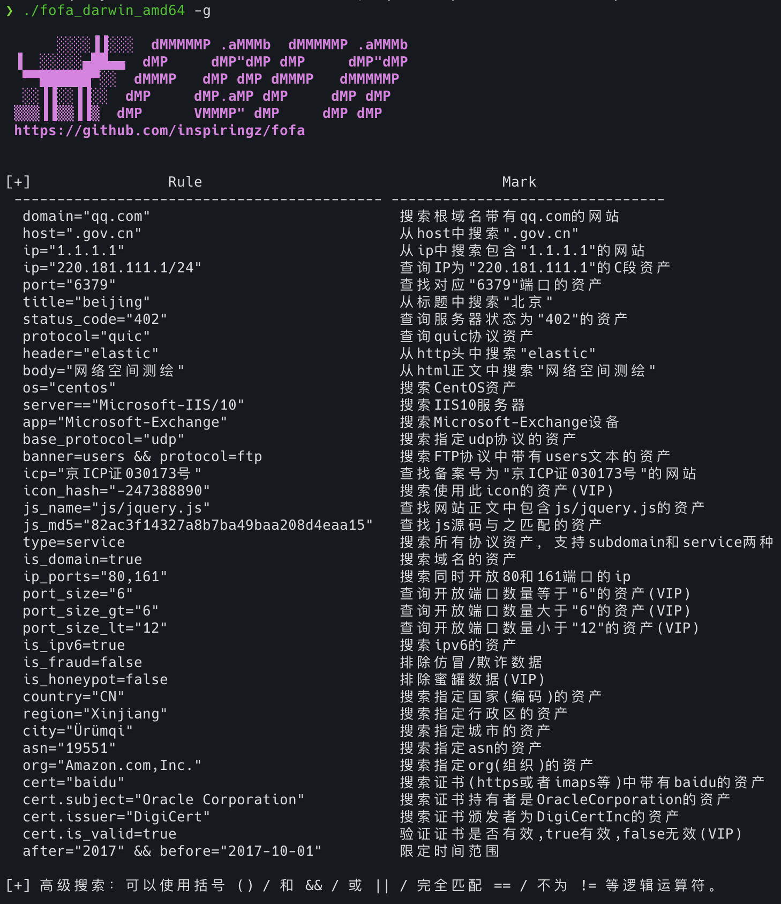

# fofa

一款 Go 语言编写的小巧、简洁、快速采集 fofa 数据导出到 Excel 表单的小工具。

- Goroutine + retryablehttp





## Build

```bash
git clone https://github.com/inspiringz/fofa
cd fofa
go build -ldflags "-s -w" -trimpath 
```

## Usage

```

      ░░░░▐▐░░░  dMMMMMP .aMMMb  dMMMMMP .aMMMb
 ▐  ░░░░░▄██▄▄  dMP     dMP"dMP dMP     dMP"dMP
  ▀▀██████▀░░  dMMMP   dMP dMP dMMMP   dMMMMMP
  ░░▐▐░░▐▐░░  dMP     dMP.aMP dMP     dMP dMP
 ▒▒▒▐▐▒▒▐▐▒  dMP      VMMMP" dMP     dMP dMP
 https://github.com/inspiringz/fofa

Usage:
  ./main -m fofa_email -k fofa_key -q 'header="elastic"' -s 10000 -o data.xlsx
  ./main -m fofa_email -k fofa_key -f query_rules_file.txt -s 10000 -o data.xlsx

Options:
  -h, --help
  -m, --mail MAIL            fofa email account (default: )
  -k, --key KEY              fofa api key (default: )
  -q, --query QUERY          query string (default: '')
  -f, --file FILE            batch query rules file (default: '')
  -s, --size SIZE            export data volume (default: 10000)
  -o, --output OUTPUT        output filename / absolute path (default: data.xlsx)
  -g, --grammar              fofa search grammar help table
  -t, --tip TIP              fofa search keyword tip droplist
  -ih, --iconhash ICONHASH   calculate url specified favicon icon_hash
```

> fofa_email / fofa_key 优先从命令行参数`-m`/`-k`指定的值中获取，若无则尝试从环境变量`FOFA_EMAIL`/`FOFA_KEY`中获取，最后尝试从 option/parsecli.go 中定义的`DefaultEmail`/`DefaultAPIKey`中获取。

- fofa search tip



- favicon icon hash



- fofa search grammar


